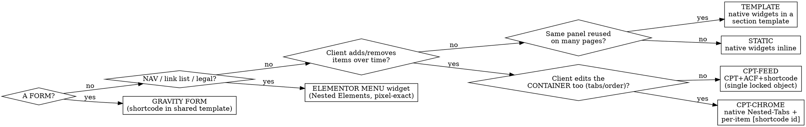

# Design → Editable Elementor WordPress Build

## Overview
Turn an **approved static design** into a **pixel-perfect, client-editable WordPress/Elementor** site — **never an HTML clone**. Almost all rework on past builds came from **building a block before deciding how it should be edited**. This skill front-loads that decision behind a signed gate, then applies proven per-block recipes.

**Core principle:** classify every block's editability FIRST (Phase 0, client-signed), then build with the matching recipe. Repeating/data content → **CPT + shortcode feed (single locked object), never a Loop Grid**. Reused static content → **section template**. Nav/links → **WP menus**. Forms → **Gravity Forms**. Nothing structural lives in an HTML/`text-editor` blob.

## When to use
Building a WP/Elementor site from an approved design; or adding/editing a panel, page, CPT feed, template, form, or nav on such a build. **Not for** the design phase (before this) or non-Elementor stacks.

## Locked stack
WordPress · Hello Elementor · **Elementor Pro (container model, not sections)** · ACF (free) · Gravity Forms · Yoast · Kinsta. Global Kit first: palette+fonts as tokens, wide content width, **`space_between_widgets=0`**. Setup, recipes, deploy: `references/stack-and-recipes.md`. QA + gotchas: `references/qa-and-gotchas.md`. **Load each reference only at its phase** — keep context lean.

## Workflow (⛔ = gate; **ask + get approval**)
0. **Discovery + Content Editability Map** ⛔ Walk the design top to bottom; classify EVERY block via the tree below into the map (block · type · who-edits-what-where · detail-page?). Capture sitemap, brand/compliance rules, implied CPTs+ACF fields, reused panels, form fields+recipients. **Ask the client the two questions below per repeating block, then get sign-off on the whole map before building anything.**
1. **Foundation.** WP + stack; permalinks `/%postname%/`; Global Kit; `space_between_widgets=0`; SVG uploads + icon map; deploy tooling. Record project specifics (site id, WP root, SSH creds, palette) in a per-project context file.
2. **Ingest design.** Save the design's exact CSS/markup/JS locally as source of truth (read px/colours/weights from it — never guess). Stand up the computed-style QA harness.
3. **Build** in order: foundation → header/footer+menus → reusable templates + their CPTs/shortcodes → homepage → inner pages → forms → SEO. **Build a shared template/CPT before the page that embeds it.** Apply the matching recipe per block.
4. **QA gate** ⛔ Pixel-diff vs design (freeze carousels `?cgstatic=1` + computed-style harness); verify editability (**no per-card "Edit Template" on locked panels**), dynamics, autosave sanity. **Show before/after for approval.**
5. **Handoff.** Localise images into WP media; SEO/redirects; CSS consolidation pass; mobile check; a "what's edited where" client guide; the autosave-reload warning.

## Decision tree — classify each block (Phase 0)
Ask per block: **(1) "Will you add/remove/reorder these over time?"** **(2) "Edit each item separately, or one locked panel edited via a content list?"** (Clients almost always want the locked panel → shortcode, not Loop Grid.)

## Golden rules (the doctrine)
1. **Single locked objects for repeating content** = CPT + ACF + shortcode of plain HTML. **Never a Loop Grid** for a locked panel (it exposes per-card "Edit Template" — repeatedly rejected by clients).
2. **No HTML clones.** No structural HTML (`div/ul/svg/address`) in a `text-editor` — plain copy + inline links only. Else use a native widget or a feed shortcode's PHP.
3. **Reusable panels = Elementor section templates**, embedded via the Template widget (edit once, propagates).
4. **Nav / link lists / legal = Elementor Menu widget (Nested Elements)** — build navigation with Elementor Pro's native nested-element Menu widget, styling links/dropdowns/mega-menus via widget settings for a pixel-exact render. Do **not** hand-roll a WP nav menu + custom walker/shortcode.
5. **Static content = native widgets** (Heading/Text/Button/Icon), typography baked into widget settings.
6. **Forms = Gravity Forms**, one central form per purpose, embedded by shortcode.
7. **Icons = inline SVG / CSS mask, never icon webfonts** (they render blank here).
8. **Editable chrome + dynamic content** → native Nested-Tabs/Accordion chrome + a per-item shortcode inside.
9. **Idempotent builders** write `_elementor_data` directly, clear the stale autosave + revisions, purge cache.
10. **Pixel-perfect is verified, not asserted** (computed-style diff + frozen-carousel screenshots).
11. **Honour the brief's brand/compliance rules** (legal name, banned words, disclaimers, punctuation).

## Ask, don't guess
Use `AskUserQuestion` (recommend the doctrine-aligned option) for: the two Phase-0 questions + map sign-off; any ambiguous design→data mapping (one field driving several displays, a design element with no field); and QA/handoff approval. Propose a default and confirm — never silently guess.

## Red flags — STOP
- About to hand-place repeating content, or drop `
/<ul>/<svg>` into a `text-editor`, or reach for a Loop Grid on a "locked" panel → wrong recipe; re-check the tree.
- Building before the Phase-0 map is signed → stop and do Phase 0.
- Claiming pixel-perfect without a computed-style/screenshot diff → not done.
