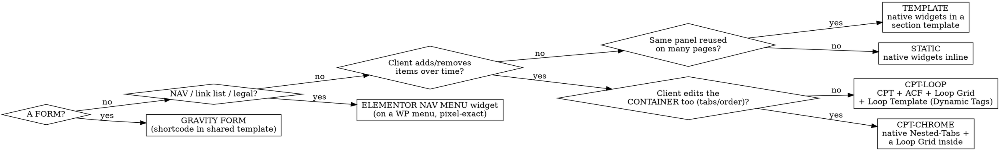

# Design → Editable Elementor WordPress Build

> Generated from `BUILD-PROCESS.md` (the single source of truth). **Don't hand-edit this skill on its own** —
> change the doctrine and regenerate, or the two drift. Methodology: **C — Loop Grid + Loop Template** (v2, 2026-07-02).

## Overview
Turn an **approved static design** into a **pixel-perfect, client-editable WordPress/Elementor** site — **never an HTML clone**. Almost all rework on past builds came from **building a block before deciding how it should be edited**. This skill front-loads that decision behind a signed gate, then applies proven per-block recipes.

**Core principle:** classify every block's editability FIRST (Phase 0, client-signed), then build with the matching recipe. Repeating/data content → **CPT + ACF, shown via a Loop Grid + Loop Template**, all values through **Dynamic Tags** (edit the card once; content lives in wp-admin). Reused static content → **section template**. Nav/links → **Elementor Nav Menu widget**. Forms → **Gravity Forms**. Nothing structural lives in an HTML/`text-editor` blob.

## When to use
Building a WP/Elementor site from an approved design; or adding/editing a panel, page, CPT loop, template, form, or nav on such a build. **Not for** the design phase (before this) or non-Elementor stacks.

## Locked stack
WordPress · Hello Elementor · **Elementor Pro (container model, not sections)** · **ACF Pro** (field groups per CPT + a Site Settings Options page) · Gravity Forms · Yoast · Kinsta. Global Kit first: palette+fonts as tokens, wide content width, **`space_between_widgets=0`**. Full setup, recipes, deploy loop and gotchas live in **`BUILD-PROCESS.md`** (§1 stack, §4 foundation, §6 recipes, §7 QA, §9 gotchas, §10 deploy); the detailed Elementor build sequence is in **`../developer/references/developer-build-order.md`**. **Load each reference only at its phase** — keep context lean.

## Workflow (⛔ = gate; **ask + get approval**)
0. **Discovery + Content Editability Map** ⛔ Requires the approved design in `static-website-reference/`. Walk it top to bottom; classify EVERY block via the tree below into the map (block · type · who-edits-what-where · detail-page?). Capture sitemap, brand/compliance rules, implied CPTs+ACF fields, reused panels, form fields+recipients. **Ask the client the two questions below per repeating block, then get sign-off on the whole map before building anything.**
1. **Foundation.** Step zero: `cp .env.example .env` → fill → `npm run init` → verify no `{{TOKEN}}` remains. WP + stack; permalinks `/%postname%/`; Global Kit; `space_between_widgets=0`; SVG uploads + icon map. Record project specifics + creds in `.env.local` (gitignored) or a secret manager — never the tracked `.env`.
2. **Ingest design.** Save the design's exact CSS/markup/JS locally as source of truth (read px/colours/weights from it — never guess). Stand up the computed-style QA harness.
3. **Build** in order: foundation → header/footer + nav menus → CPTs + ACF + Loop Templates → reusable Global/Saved sections → homepage → inner pages → forms → SEO. **Build a CPT + Loop Template / shared section before the page that embeds it.** Apply the matching recipe per block.
4. **QA gate** ⛔ Pixel-diff vs design (freeze carousels + computed-style harness); verify editability (CPT content edits in wp-admin, Loop card edits once in the Loop Template, nav in Appearance→Menus), dynamics, autosave sanity. **Show before/after for approval.**
5. **Handoff.** Localise images into WP media; SEO/redirects; CSS consolidation pass; mobile check; a "what's edited where" client guide; the autosave-reload warning.

## Decision tree — classify each block (Phase 0)
Ask per block: **(1) "Will you add/remove/reorder these over time?"** **(2) "Do you edit each item as its own entry in a content list (wp-admin), with the page just displaying them?"**

## Golden rules (the doctrine)
1. **Repeating content = CPT + ACF, shown by a Loop Grid + Loop Template.** One card template, edited once; content managed in wp-admin; every value a Dynamic Tag. Never hand-place repeating items or hard-code CPT data into widgets.
2. **No HTML clones.** No structural HTML (`div/ul/svg/address`) in a `text-editor` — plain copy + inline links only. Else use a native widget or a Loop Template's widgets.
3. **Reusable panels = Elementor section templates** (Global/Saved), embedded via the Template widget (edit once, propagates).
4. **Nav / link lists / legal = Elementor Pro Nav Menu widget** (built on a WP menu in Appearance→Menus) — style links/dropdowns/mega-menus via widget settings for a pixel-exact render. Do **not** hand-roll a custom walker.
5. **Static content = native widgets** (Heading/Text/Button/Icon), typography baked into widget settings.
6. **Forms = Gravity Forms**, one central form per purpose, embedded by shortcode.
7. **Icons = inline SVG / CSS mask, never icon webfonts** (they render blank here).
8. **Editable chrome + dynamic content** → native Nested-Tabs/Accordion chrome + a Loop Grid (or Dynamic-Tag-bound widgets) inside.
9. **Build in the Elementor UI / Theme Builder; register CPTs/ACF/Options in code.** If you ever script a document, write `_elementor_data` directly, clear the stale autosave + revisions, flush cache.
10. **Pixel-perfect is verified, not asserted** (computed-style diff + frozen-carousel screenshots).
11. **Honour the brief's brand/compliance rules** (legal name, banned words, disclaimers, punctuation).

## Ask, don't guess
Use `AskUserQuestion` (recommend the doctrine-aligned option) for: the two Phase-0 questions + map sign-off; any ambiguous design→data mapping (one field driving several displays, a design element with no field); and QA/handoff approval. Propose a default and confirm — never silently guess.

## Red flags — STOP
- About to hand-place repeating content, drop `
/<ul>/<svg>` into a `text-editor`, or hard-code a CPT value instead of a Dynamic Tag → wrong recipe; re-check the tree.
- Building before the Phase-0 map is signed (or with no design in `static-website-reference/`) → stop and do Phase 0.
- Claiming pixel-perfect without a computed-style/screenshot diff → not done.
